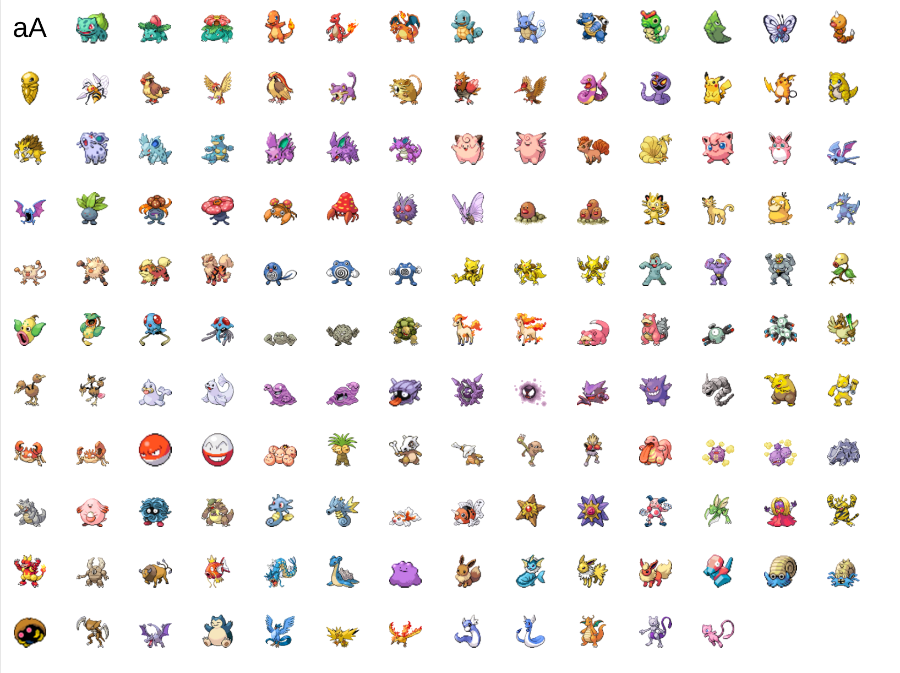

# pokemon-font

Build a [TrueType](https://en.wikipedia.org/wiki/TrueType) font containing sprites for the first 151 Pokemon. See `dist/Pokemon 151.ttf`



Each Pokemon is mapped to a codepoint in Supplementary Private Use Area-B
starting at `U+100000`, so they can be typed like regular glyphs. Static
sprites are always included; animated (Generation V) frames can be appended
as well.

## Requirements

- [Bun](https://bun.sh)
- Python 3 (for the `nanoemoji` virtualenv)
- macOS or Linux (font installation; other scripts run on any platform with Bun)

## Quick start

Sprites are checked into `sprites-source/`, so no network access is needed to build
(originally sourced via [PokeAPI/sprites](https://github).

Run the whole pipeline with the included script:

```sh
./run.sh
```

This will:

1. Create a Python virtualenv and install `nanoemoji`.
2. Convert sprites from `sprites-source/` into SVGs, stored in `processed-assets/`.
3. Build the font with `nanoemoji`.
4. Copy the `.ttf` (and preview HTML) to `dist/`.
5. Install the font locally.

The default font is written to `dist/Pokemon 151.ttf`.

## Options

Pass these flags to `run.sh` or the individual `bun run` scripts:
| Flag | Description |
| -------------------------- | ------------------------------------------------------------------------------------------------- |
| `-a`, `--animated` | Also append animation frames from Generation V sprites after the static glyphs; default name becomes `Pokemon 151 (Animated)` |
| `-f`, `--font-name <name>` | Set the generated font family name and output filename |
| `-h`, `--help` | Show help |
Examples:

```sh
# Build a font with static glyphs plus animation frames (still a WIP)
./run.sh --animated
# Build a font with a custom name
./run.sh --font-name "My Pokemon Font"
```

## Codepoint mapping

The 151 static glyphs are assigned in Pokedex order starting at `U+100000`:

- Bulbasaur → `U+100000`
- Ivysaur → `U+100001`
- Venusaur → `U+100002`
- ...
- Mew → `U+100096`
  When built with `--animated`, animation frames are appended after the static glyphs, starting at `U+100097` (i.e. `U+100000 + 151`). Frames are grouped by Pokemon in Pokedex order, and each Pokemon's frame count varies with its source GIF.
  In JavaScript, you can render a specific Pokemon's static glyph with `String.fromCodePoint(0x100000 + id - 1)`.

## Sprites

Sprite source images live in `sprites-source/` (`static/` and `animated/`) and are checked into the repo so builds don't depend on network access.
Note the sprites themselves are copyrighted by The Pokémon Company; PokeAPI's repo license only covers their own compilation, not the sprite images.

## Scripts

| Script                  | Description                                                                           |
| ----------------------- | ------------------------------------------------------------------------------------- |
| `bun run font-download` | Convert local sprites into SVGs in `processed-assets/` plus raw PNGs in `raw-assets/` |
| `bun run font-build`    | Run `nanoemoji` and output `build/<font-name>.ttf`                                    |
| `bun run font-copy`     | Copy the built font and preview HTML to `dist/`                                       |
| `bun run font-install`  | Install the font for the current user (macOS/Linux only)                              |
| `bun run font-preview`  | Serve `dist/font-preview.html` and the font at `http://localhost:3000`                |

## Preview

After building, start the preview server. Pass `--animated` if you built an animated font, so the preview knows to fetch frame counts and animate the glyphs:

```sh
bun run font-preview -- --animated
```

Then open [http://localhost:3000](http://localhost:3000).
